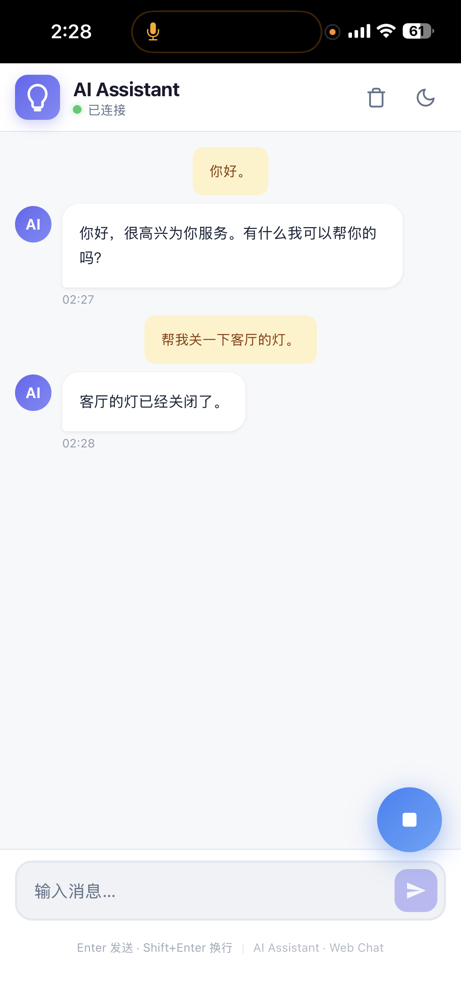

<div align="center">

# Qwen3-ASR-LLM-TTS & MCP Chat AI Assistant

**A fully local, multilingual voice AI assistant for your Windows PC**

[](https://www.python.org/)
[](https://developer.nvidia.com/cuda-toolkit)
[](#)

</div>

---

> An easy-to-deploy multilingual AI assistant integrating
> [Qwen3-ASR](https://github.com/QwenLM/Qwen3-ASR) for speech recognition,
> [Ollama](https://ollama.com/) + [Qwen3-30B-A3B](https://ollama.com/dengcao/Qwen3-30B-A3B-Instruct-2507) for LLM,
> [Qwen3-TTS](https://github.com/QwenLM/Qwen3-TTS) / [Kokoro](https://github.com/hexgrad/kokoro) for speech synthesis,
> and [MCP](https://github.com/modelcontextprotocol/python-sdk) for smart device control.

---

## ✨ Features

| Category | Highlights |
|---|---|
| **Speech Recognition** | Multilingual (Chinese / English / Japanese …) via Qwen3-ASR |
| **Language Model** | Powered by Qwen3-30B-A3B-Instruct-2507 through Ollama |
| **Speech Synthesis** | Natural & expressive TTS with Qwen3-TTS or Kokoro |
| **Smart Control** | MCP integration for IoT / smart device control |
| **Interaction** | Real-time streaming LLM + TTS voice conversation |
| **Interface** | Web UI + PyQt6 desktop debug app |
| **Hardware** | Runs on a single RTX 3090 24 GB GPU |

## 🔌 Implemented MCP Tools

| Tool | Description |
|---|---|
| [SwitchBot](https://github.com/OpenWonderLabs/SwitchBotAPI) | Smart home device control (example integration) |
| Weather | Real-time weather information query |
| Local Commands | Execute local system commands |
| Current Time | Return current time in ISO, human-readable format and Unix timestamp (supports optional IANA timezone parameter) |
| Open Website | Open an http/https URL in the default browser (returns success/failure information) |
| Clear Chat | Request the assistant to clear its current chat history (tool call triggers local clear action) |

## 🖼️ Demo

<summary><b>Desktop Web UI</b></summary>


<summary><b>Mobile (via Tailscale)</b></summary>

Access the web GUI remotely from your phone using [Tailscale](https://tailscale.com/).

  

---

## 🚀 Getting Started

### Prerequisites

- **OS:** Windows 10 / 11
- **GPU:** NVIDIA RTX 3090 (24 GB) or above
- **Python:** 3.12
- **Package Manager:** [uv](https://github.com/astral-sh/uv)

### 1. Create Environment

```bash
uv venv qwen-asr --python 3.12
```

### 2. Install Core Dependencies

```bash
# PyTorch + CUDA
uv pip install torch torchvision --index-url https://download.pytorch.org/whl/cu128

# Flash Attention (prebuilt wheel)
uv pip install --no-deps https://github.com/mjun0812/flash-attention-prebuild-wheels/releases/download/v0.7.13/flash_attn-2.8.3+cu128torch2.10-cp312-cp312-win_amd64.whl

# Transformers & utilities
uv pip install transformers==4.57. nagisa==0.2.11 soynlp==0.0.493 qwen-omni-utils
uv pip install sox flask pytz accelerate==1.12.0
```

### 3. Install ASR

```bash
cd ./Qwen3-ASR
uv pip install -e .
```

### 4. Install TTS

```bash
# Qwen3-TTS
uv pip install einops onnxruntime torchaudio
cd ./Qwen3-TTS/
uv pip install -e .

# Kokoro
uv pip install pip  # required first!
uv pip install loguru "misaki[zh]>=0.9.4"
uv pip install num2words spacy phonemizer espeakng_loader
cd ./kokoro
uv pip install -e .
```

### 5. Install AI Assistant

```bash
uv pip install requests beautifulsoup4 sounddevice
uv pip install PyQt6 ollama keyboard mcp flask_socketio
```

---

## 🎮 Usage

```bash
python ai_assistant_llm_streaming.py
```

| Shortcut | Action |
|---|---|
| — | Open browser → `http://localhost:5100` |
| `Ctrl + Alt + Q` | Open PyQt6 debug app |
| `Ctrl + Alt + A` (hold) | Push-to-talk |
| `Ctrl + Alt + E` | Quit |

---

## 🖱️ Windows Quick Start

For convenience, a PowerShell launcher `run_ai_assistant.ps1` and a helper script `create_desktop_shortcut.ps1` are provided to quickly launch the AI assistant and to create a desktop shortcut.

- Run `run_ai_assistant.ps1` directly when you want to launch the assistant in a PowerShell session. Example:

```powershell
# Launch and activate a named uv environment (optional)
.\run_ai_assistant.ps1 -EnvName dev
```

- Create a Desktop shortcut automatically (recommended):

```powershell
# In repository folder, create a desktop shortcut that points to the PowerShell launcher
.\create_desktop_shortcut.ps1 -ShortcutName "AI Assistant"
# Or create a shortcut that invokes the .bat wrapper instead
.\create_desktop_shortcut.ps1 -ShortcutName "AI Assistant (bat)" -UseBat
```

- Manual shortcut target (if you prefer to create it by hand):

```
C:\Windows\System32\WindowsPowerShell\v1.0\powershell.exe -NoProfile -ExecutionPolicy Bypass -File "D:\mcp\run_ai_assistant.ps1"
```

中文：

- `run_ai_assistant.ps1`：PowerShell 启动器，用法示例：

```powershell
.\run_ai_assistant.ps1 -EnvName dev
```

- 自动创建桌面快捷方式（推荐）：运行仓库中的 `create_desktop_shortcut.ps1`：

```powershell
.\create_desktop_shortcut.ps1 -ShortcutName "AI Assistant"
.\create_desktop_shortcut.ps1 -ShortcutName "AI Assistant (bat)" -UseBat
```

- 手动创建快捷方式的目标命令：

```
C:\Windows\System32\WindowsPowerShell\v1.0\powershell.exe -NoProfile -ExecutionPolicy Bypass -File "D:\mcp\run_ai_assistant.ps1"
```

Note: After creating the desktop shortcut you can right-click it to pin to Start or Taskbar. If you want an automated step to pin the shortcut to taskbar, I can add an optional script (requires elevation).

---

## ⚠️ Notice

> Before running, update model paths and config paths in **kokoro** and **switchbot** to match your local setup.

---

## 📚 References

| Project | Link |
|---|---|
| Kokoro | <https://github.com/hexgrad/kokoro> |
| MCP Python SDK | <https://github.com/modelcontextprotocol/python-sdk> |
| Ollama | <https://ollama.com/> |
| Qwen3-ASR | <https://github.com/QwenLM/Qwen3-ASR> |
| Qwen3-TTS | <https://github.com/QwenLM/Qwen3-TTS> |
| SwitchBot API | <https://github.com/OpenWonderLabs/SwitchBotAPI> |
| Tailscale | <https://tailscale.com/> |