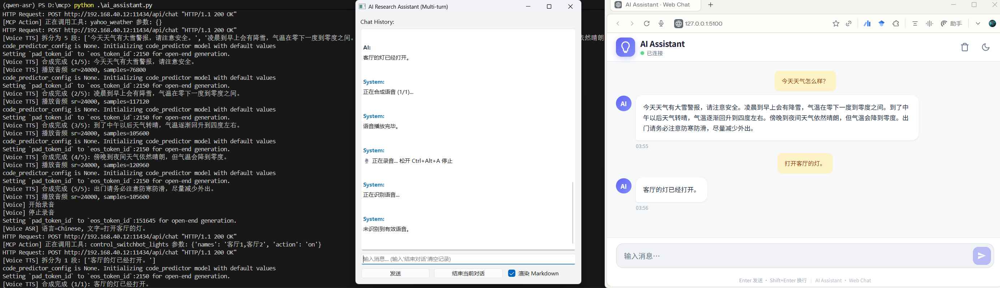
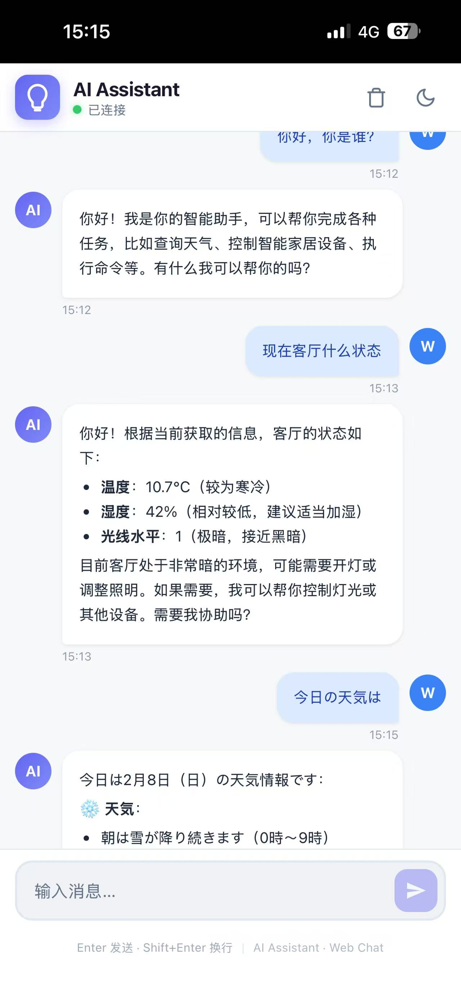

# Qwen3-ASR-LLM-TTS_MCP-Chat-AI-Assistant

This is an easy to use and deployable local AI assistant on your Windows PC, integrating [Qwen3-ASR](https://github.com/QwenLM/Qwen3-ASR) for speech recognition, [Ollama](https://ollama.com/) [Qwen3-30B-A3B-Instruct-2507](https://ollama.com/dengcao/Qwen3-30B-A3B-Instruct-2507) for LLM, [Qwen3-TTS](https://github.com/QwenLM/Qwen3-TTS) or [Kokoro](https://github.com/hexgrad/kokoro) for text-to-speech synthesis, and [MCP](https://github.com/modelcontextprotocol/python-sdk) for device control.

## Features

- Multilingual speech recognition (Chinese, English, Japanese...) with Qwen3-ASR
- Multimodal language understanding and generation with Qwen3-30B-A3B-Instruct-2507
- Multilingual speech synthesis (Chinese, English, Japanese...) with Qwen3-TTS or Kokoro
- High-accuracy speech recognition with Qwen3-ASR
- Powerful language understanding and generation with Qwen3-30B-A3B-Instruct-2507
- Natural and expressive speech synthesis with Qwen3-TTS or Kokoro
- Seamless integration with MCP for smart device control
- Real-time voice interaction with streaming LLM and TTS
- Customizable and extensible architecture
- Open-source and free to use
- Lightweight and efficient implementation (RTX 3090 24GB GPU)
- User-friendly GUI with web interface and PyQt6 desktop debug app

## Implemented MCP

- [SwitchBot](https://github.com/OpenWonderLabs/SwitchBotAPI) devices control (An example)
- Weather information query
- Run local commands

## Demo



- Using Tailscale to access the web GUI remotely from your phone.



# ENV

```bash
uv venv qwen-asr --python 3.12
uv pip install torch torchvision --index-url https://download.pytorch.org/whl/cu128
uv pip install --no-deps https://github.com/mjun0812/flash-attention-prebuild-wheels/releases/download/v0.7.13/flash_attn-2.8.3+cu128torch2.10-cp312-cp312-win_amd64.whl

uv pip install transformers==4.57.
uv pip install nagisa==0.2.11 
uv pip install soynlp==0.0.493
uv pip install qwen-omni-utils

uv pip install sox
uv pip install flask
uv pip install pytz

uv pip install accelerate==1.12.0

cd ./Qwen3-ASR
uv pip install -e .

# for tts
uv pip install einops onnxruntime torchaudio
cd ./Qwen3-TTS/
uv pip install -e .

# kokoro
uv pip install pip  # !!
uv pip install loguru
uv pip install misaki[zh]>=0.9.4
uv pip install num2words spacy phonemizer espeakng_loader
cd ./kokoro
uv pip install -e .

# ai assistant
uv pip install requests beautifulsoup4
uv pip install sounddevice
uv pip install PyQt6 ollama keyboard mcp
uv pip install flask_socketio
```

# Usage

```bash
python ai_assistant.py
```

- Open your web browser and go to `http://localhost:5100` to access the AI assistant web interface.
- Press `Ctrl + Alt + Q` to open PyQt6 debug app.
- Press and hold `Ctrl + Alt + A` to speak to the AI assistant.
- Press `Ctrl + Alt + E` to Quit.

# Notice

Change model paths and config paths in kokoro and switchbot to your local paths before running.

# References

- Qwen3-ASR: https://github.com/QwenLM/Qwen3-ASR
- Qwen3-TTS: https://github.com/QwenLM/Qwen3-TTS
- Kokoro: https://github.com/hexgrad/kokoro
- Ollama: https://ollama.com/
- MCP: https://github.com/modelcontextprotocol/python-sdk
- SwitchBot: https://github.com/OpenWonderLabs/SwitchBotAPI
